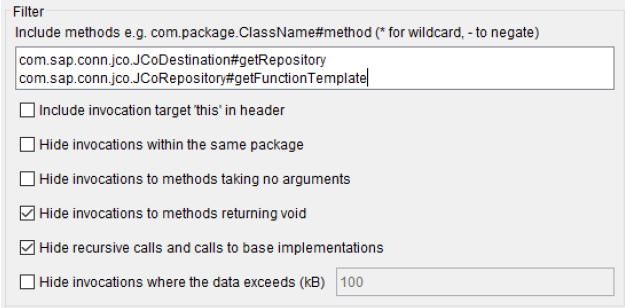
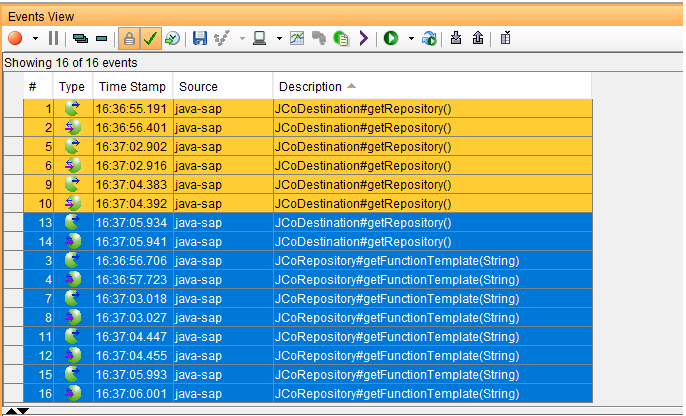

# SAP Virtualization Without a Connection to the SAP System
## Introduction
Support for virtualizing SAP RFC calls is achieved by using the Java Agent to intercept calls made by applications that use the SAP Java Connector.  The application still requires a connection to the SAP server to retrieve metadata.  Please see product documentation for more details.

In some circumstances, a SAP server may not be available in the environment in which virtualization is required.  In this case, with IBM Rational Integration Tester 9.5, it is possible to record interactions where a SAP server is available for use in that environment.

## Steps
__Pre-requisite__: a project that is configured to record SAP RFC interactions using the Java Agent. 

Additional configuration is required in order to record calls to retrieve metadata, namely a Java Application Transport with Recording Studio settings as shown below:

A pre-configured transport is available in __sap-metadata-recording.zip__, the following steps detail how to import this into an existing project, use it to record metadata, and generate a stub:

1. Import the __sap-metadata-recording.zip__ file:
   1. __Project__ -> __Import Resources…__
   1. Select s__ap-metadata-recording.zip__
   1.	Select default options and complete wizard
1. Configure the physical Java Application transport
   1. In Logical View right-click on the __sap-metadata-recording__ transport
   1. From the context menu: Set Binding In -> <environment> -> Create new JVM
   1. In most cases, just save with the default values (refer to product documentation for further details on JVM configuration)
1. Record the SAP RFC calls and metadata
   1. In Logical view, select the __sap-metadata-recording__ transport and the existing SAP transport.
   1. Click the record button to add these as monitors and take you to the Recording Studio perspective
   1. Start recording
1. Perform interactions with the SAP system, when done stop the recording
   1. Click the stop recording button in Recording Studio
1. Generate a stub to provide SAP metadata
   1. In Recording Studio, select the __sap-metadata-recording__ monitor in the Monitor Configuration.
   1. Click on the Description column to sort it in ascending order
   1. Select the last 2 “JCoDestination#getRepository()” events and all of the “JCoRespository#getFunctionTemplate(String)” events. (e.g. select the event representing the final call to getRepository and use Ctrl-Shift-End to select the remaining events):

   1. Click on “Create stubs from recorded events” button, complete the Wizard selecting where to create the stub and what to call it (e.g. under the pre-existing SAP system with a name of “metadata”).
  
Having created this stub, you will be able to virtualise calls to any of the RFCs for which you have virtualised __getFunctionTemplate__ from applications that use the SAP Java Connector without having to connect to a SAP server.  Consult the product documentation for more details on creating stubs for SAP RFC calls.
